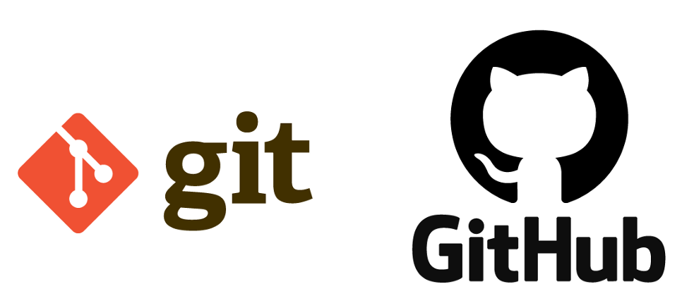
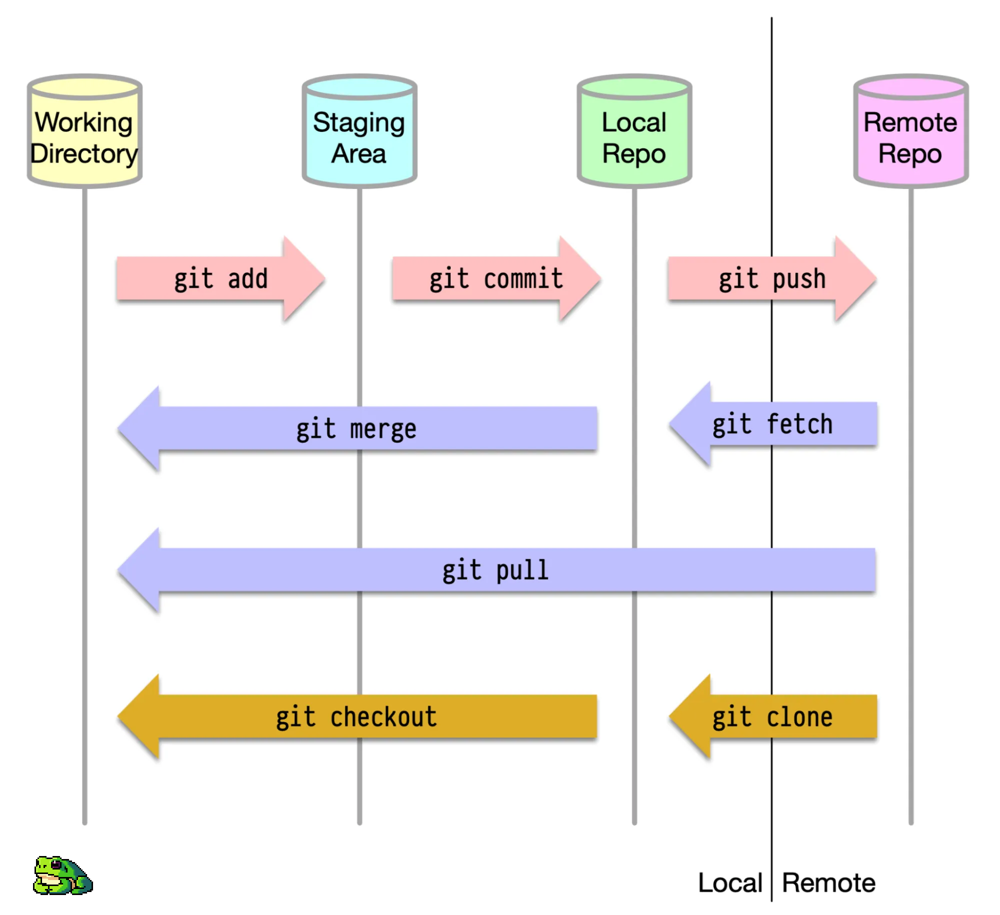
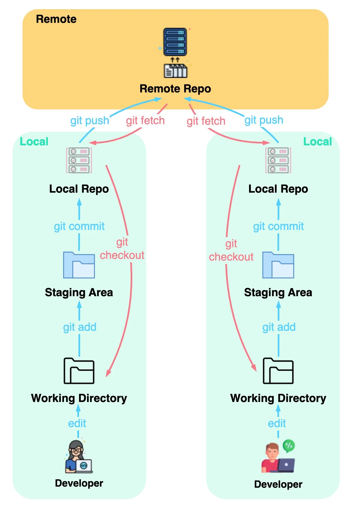

Understand what is Git and GitHub?

# What is Git and Github?

- Git:
  - A **distributed version control system (VCS)** that tracking changes in source code during software development. 
  - It allows you to manage your codebase efficiently, collaborate with others, and revert to previous versions if needed.

- GitHub:
  - web-based Git repository hosting service, which offers all of the distributed revision control and source code management (SCM) functionality of Git as well as adding its own features. 

|  | Git | Github |
|---|---|---|
| 1 | software | service |
| 2 | command-line interface (CLI) | graphical user interface (GUI)|
| 3 | installed locally on the system | hosted on the web |
| 4 | manage source code history | hosting service for Git repositories |

# Git vs. Other Version Control Systems

# Basic Git Workflow

- Working directory: where we edit files
- Staging area: a temporary location where files are kept for the next commit
- Local repository: contains the code that has been committed
- Remote repository: the remote server that stores the code

## Git workflow when teamwork

# References 

<a href = "https://www.geeksforgeeks.org/difference-between-git-and-github">Difference Between Git and GitHub</a>  - Geeksforgeeks  
<a href = "https://blog.bytebytego.com/i/95179881/how-does-git-work"> How does git work? </a> - ByteByteGo