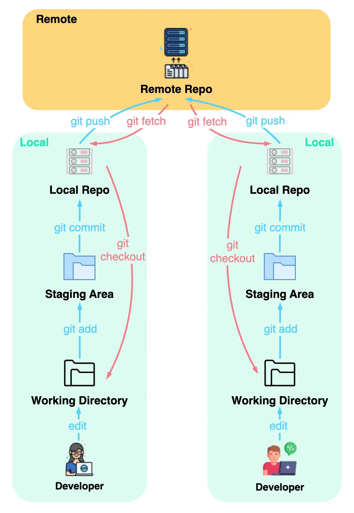

How to working with branches

# What is Branching?
<div style="text-align: center"></div>

**Branching** means diverging from the mainline and continue to work separately without messing with the mainline. In Git, a branch is simply a reference to the commit, where the following commits will be attached.

**Why use branches?** Branches allow you to work on different features or bug fixes simultaneously without affecting the main codebase.

## Branching example
- **Creating a new branch**: 
```
git branch <branch_name>
```

- **Switch to the new branch**:  
Sử dụng ```git checkout <branch_name>```  
hoặc ```git switch <branch_name>```  

Switching to a branch: Use git checkout <branch_name> to switch to a different branch.

|         | git switch                                | git check out                               |
|---------|-------------------------------------------|---------------------------------------------|
| Purpose | Branch switching                          | Branch switching, branch creation, file creation | 
|Uncommitted changes| Automatically **stashes** and **reapply** | Prompts for commit/stash |

- **List all branches**  
```git branch```: List all local branches  
```git branch -a```: List all local and remote branches

# How to merge branches?
When we work together as a team, we will need to combine everybody code into one branch
- **Merge**  
```git merge [<branch_name_1> <branch_name_2>,..., <branch_name_n>] ```: merge all the branches in the list into the current branch 

[//]: # (<div style="text-align: center"></div>)
- **Solve conflicts**

## Git workflow when teamwork
<div style="text-align: center;"></div>

# Git basics
## Preparation
Download and install Git from official Git website: 
<a href = "https://git-scm.com/downloads"> Git SCM </a>  
Configure Git:
```
git config --global user.name "Your Name"
git config --global user.email "your.email@example.com"
```

## Basic commands
- **Create a new directory**: This will be the root of your project.  
- **Initialize a Git repository**: Navigate to the directory and run:
```
git init
```

- **Create a file**
- **Add change files to the staging area**
```
git add <filename>: add files to the staging area
```
```
git add .: add all changed files to the staging area 
```
- **Commit changes**: Create a snapshot of the staged changes
```
git commit -m "<commit message>"
```
- **View commit history**: Use git log to view the commit history.
```
git log
```

# References 

<a href = "https://www.geeksforgeeks.org/introduction-to-git-branch">Introduction to Git Branch
</a>  - Geeksforgeeks  
<a href = "https://stackoverflow.com/questions/57265785/whats-the-difference-between-git-switch-and-git-checkout-branch">What's the difference between 'git switch' and 'git checkout' <branch>?</a> - StackOverflow